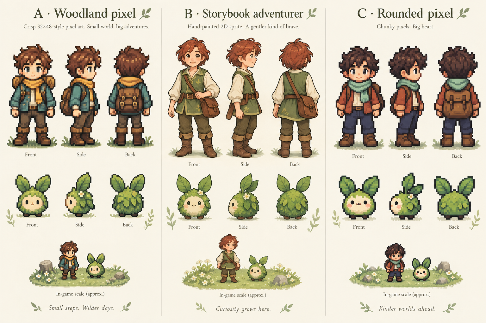

# Character art directions

Concept comparison for Mosswild. No direction has been selected yet; these are concept turnarounds, not production animation atlases.

- A: Woodland pixel — detailed explorer with teal coat and ochre scarf.
- B: Storybook adventurer — soft painted woodland characters.
- C: Rounded pixel — compact proportions and bold silhouettes.

After selection: produce consistent four-direction walking frames, test at actual mobile game scale, and integrate the matching traveller and companion artwork. The concept sheet does not replace the current game sprites.
